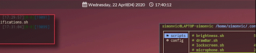
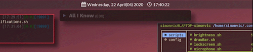
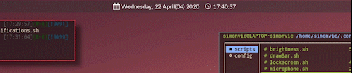
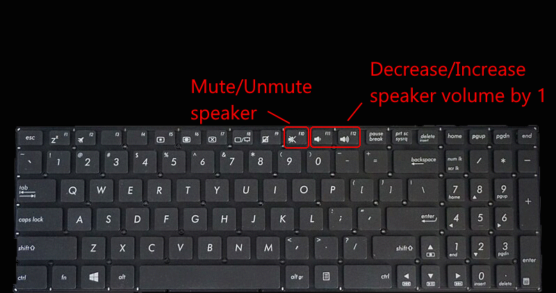

# simonvic personal full-keyboard driven rice/workflow 

## Getting started
Make sure to visit the [Wiki](https://github.com/simonvic/dotfiles/wiki) to have a ful overview of what my workflow can offer

## Requirements
Main requirements:
* i3-gaps : the tiling window manager with gaps
* i3lock-color : Used to lock the screen
* Polybar : show bars with various information 
* Dunst : notifications daemon
* Rofi : application launcher
* more...

Visit the [installation guide](https://github.com/simonvic/dotfiles/wiki/Installation-and-Configuration) for a more in-depth explanation
 
## Lockscreen (i3lock-color)

 
 Other themes preview 

 

## Application launcher (Rofi)

## Polybar with auto-hide wrapper

## Notifications and more (Dunst)
### Playerctl control + custom Spotify notification

### Speaker and microphone control

### Brightness and Redshift control

### App notifications

## Keybindings
My workflow is 100% keyboard-driven as I have everything at the tip of my fingers
A brief about keybinding of some of my scripts.
[Check the wiki](https://github.com/simonvic/dotfiles/wiki/Keybindings) for more

